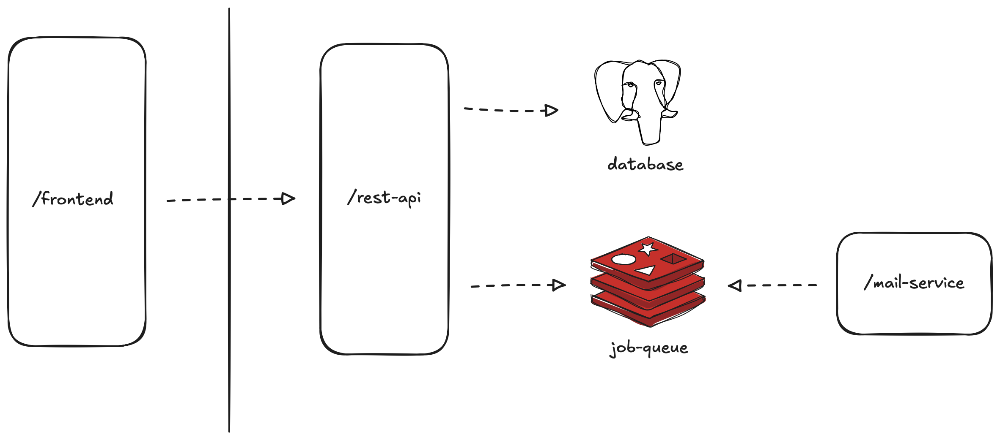

# AnythingYouWantt

#### Table of Contents

- [Introduction](#introduction)
  - [Application Achitecture](#application-architecture)
  - [System Architecture](#system-architecture)
- [Software Development Lifecycle](#software-development-lifecycle)
  - [Developer Platform](#developer-platform)
  - [Staging](#staging)
  - [Production](#production)

## Introduction

Welcome to the *official docs* for ***anythingyouwantt***. 

### Application Architecture



- The web application accepts clients' requests from the `/frontend` and sends it to the `/rest-api`. 

- From there the `/rest-api` can interact with the `postgres` database to perform various stateful CRUD operations.

- The `/rest-api` will send a job to the `redis` job queue (upon a request for an order) for the `/mail-service` to carry out the order and then send a job back to `redis` to alert the `/rest-api` to update that order.

### System Architecture

The system architecture includes the all the services needed during deployment.

[show graph illustrating architecture]

<div class='back-to-top' style="text-align: right"><a href="#table-of-contents" style="font-size: 12px;">BACK TO TOP</a></div>

## Software Development Lifecycle

### Developer Platform

The purpose of the development environment and our developer platform is to build the application architecture.

#### Prequisites

```
1. Docker Compose
2. node.js
3. VS Code
```

These are the three essential tools we need to build the application in our local dev environment. Docker Compose allows us to quickly start and tear down backing services as needed. Nodejs is the runtime for our two backend services and it's needed to start the dev server for our frontend. VS Code is the IDE of choice.

### Staging

At this point we've verified the application (architecture) is all set and built all the services.

Staging allows us to test out the system architecture and verify as much as we can that everything works before sending the app to production, and starting the compose project on the ec2 instance.

### Production

Here are the steps to deploy it to production.

<div class='back-to-top' style="text-align: right"><a href="#table-of-contents" style="font-size: 12px;">BACK TO TOP</a></div>